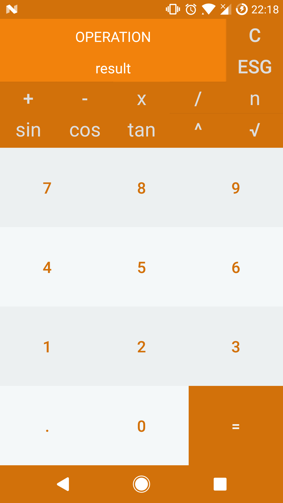

<h1>Scientific Calculator</h1>
<table width="100%" border="0">
	<tr width="100%">
		<td width="20%">
			
		</td>
		<td width="80%" align="center" style="text-align: center;">
				Scientific calculator developed in Android Studio, its principle of operation is to print the contents of its buttons in the text string, which will be extracted later to perform the respective operations of each of them.
		</td>
	</tr>
</table>
<b>Errors found</b>
<ul>
	<li>Problems when a negative number is at the start of the string</li>
	<li>Design is not adaptive</li>
	<li>When the chain is too large, it tends to hang</li>
</ul>

	Developed by
	<a href="https://www.facebook.com/AntMenGo">
		Antonio Mendoza
	</a>

